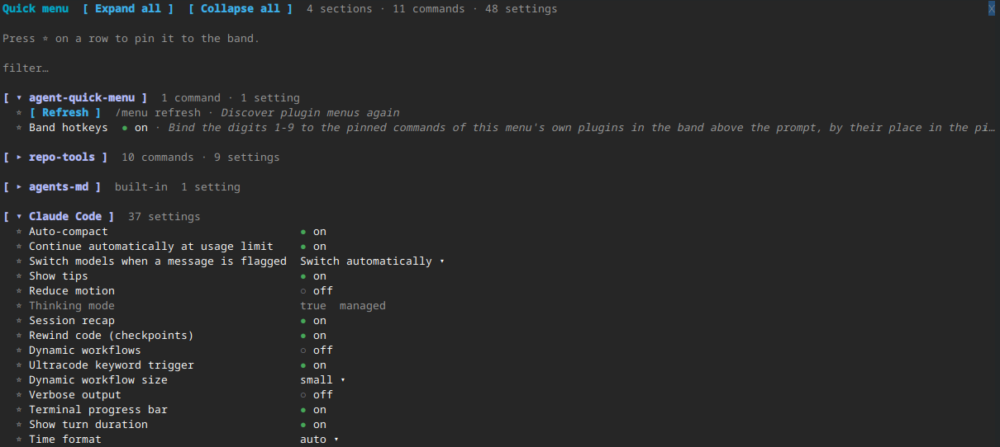

# agent-quick-menu

[](LICENSE)
[](https://github.com/agentic-workbench/agent-quick-menu/actions/workflows/ci.yml)

A quick menu for Claude Code: every plugin's commands and settings, and Claude Code's own, in one pane and a band above the prompt.



## Requirements

Claude Code 2.1.287 or newer, in the terminal or the Desktop Code tab, on macOS or Linux. The VS Code chat panel is not supported. Windows paths (`USERPROFILE`, `;` in `CLAUDE_CODE_PLUGIN_DIRS`) are read, but the menu is untested there.

## Install

In a Claude Code session:

```
/plugin marketplace add agentic-workbench/agent-quick-menu
/plugin install agent-quick-menu@agent-quick-menu
/reload-plugins
```

Or from a shell:

```
claude plugin marketplace add agentic-workbench/agent-quick-menu
claude plugin install agent-quick-menu@agent-quick-menu
```

Then run `/reload-plugins` in a running session.

## Usage

- `/menu` opens the pane. `/menu refresh` discovers plugin menus again.
- The band above the prompt is one line: `≣ menu │ Pull  Status …` (hotkey `m` while the band is focused, then your favourites). With `bandHotkeys` on, own-plugin commands read `1 Pull  3 Status`, the digit being the place in the pinned list.
- `ctrl+x tab` focuses the band.
- Band digits are opt-in: with the `bandHotkeys` setting on (default off) and an empty prompt, `1` to `9` press the pinned commands of this plugin only, numbered by their position in the pinned list (a gap keeps the other numbers). Other plugins' commands and setting favourites carry no digit. Digits do not arm while the band scrolls, and another mod's same hotkey may win.
- `☆` / `★` on any row adds or removes a favourite. Favourites are listed first in the pane.
- Every section folds: press its header (`▸` / `▾`). Favourites start open, every other section folded. `Expand all` (`e`) and `Collapse all` (`c`) sit on the top line; the state is kept across sessions. The pane closes with Claude Code's own `×`, Escape or ctrl+x x. With no favourites yet, the pane says to press `☆` on a row.
- The filter field at the top (`filter…`) matches setting labels and keys and command names, case-insensitive, across every section. Sections without a match are hidden, matching ones open while a filter is set, and the counts follow.
- Every setting row is a plain label and a value: a boolean is a small `[ on ]` / `[ off ]` toggle, a choice keeps `value ▾`.
- If the terminal is too narrow to place the pane, a toast says so and the band lists the sections (header buttons, at most as many rows as the band may take, and a `Close` button, since the engine draws no close mark there) instead.
- `[-]` at the end of the band (drawn by Claude Code, or ctrl+x ctrl+a) folds the band.

## What appears

- One section per plugin that ships a `.claude-plugin/quick-menu.json`: its commands as a wrapping row of buttons and its settings (`userConfig`) as an aligned label/value table.
- A commands-only section for a plugin loaded with `--plugin-dir` whose root is not known (see Limitations): its registered commands, and a dim line saying to set `CLAUDE_CODE_PLUGIN_DIRS`.
- A settings-only section for each plugin without the file that has `userConfig` rows.
- A "Claude Code" section with Claude Code's own settings.
- A locked row (`managed`) is set by managed policy and cannot be changed here.
- A "Problems" list shows plugin files that were skipped and why.

## What this plugin does on your machine

**Slash commands it runs, and when.** Only when you press a button or a band favourite, and only the command that row shows: `/<command> <args>` from a plugin's `quick-menu.json`. Built-in commands and other plugins' commands need a second press within 5 seconds. When you change a setting row it runs `/config <key>=<value>`. It runs nothing on its own.

**What it sets.** Only the `/config` rows you change in the pane. It sets no environment variables. It keeps favourites and folded sections in Claude Code's plugin store.

**What it reads.** Your settings (`enabledPlugins`), the plugin registry `installed_plugins.json` under `CLAUDE_CONFIG_DIR` or `~/.claude`, the environment variables `CLAUDE_CONFIG_DIR`, `HOME`, `USERPROFILE` and `CLAUDE_CODE_PLUGIN_DIRS`, and each plugin's `.claude-plugin/quick-menu.json`. It sends nothing over the network and reads no credentials.

**Its hooks.**

- `ui.render` on `AbovePrompt`: adds its own row and keeps every other mod's band beneath it.
- `ui.render` on its `Pane`: draws the menu.
- `command.run` for `/menu` only: answers it and touches no other command.
- `plugin.register`: only records the root of plugins loaded with `--plugin-dir`; it changes nothing.
- `session.start`: registers `/menu`, loads favourites and folds, and starts discovery.

## For plugin authors

Add `.claude-plugin/quick-menu.json` to your plugin:

```json
{
  "$schema": "https://raw.githubusercontent.com/agentic-workbench/agent-quick-menu/main/schema/quick-menu.schema.json",
  "version": 1,
  "commands": [{ "command": "my-plugin:status", "label": "Status" }]
}
```

The full format is in [docs/convention.md](docs/convention.md).

## Limitations

- There is no global hotkey; the band hotkeys work only while the band is focused or the prompt is empty.
- A `--plugin-dir` plugin's root is only learned when its hooks module loads after this one (`plugin.register`; kept across a reload of the menu); a plugin without one, or loaded earlier, is listed from `$.command.list()` with its commands only. Set `CLAUDE_CODE_PLUGIN_DIRS` to the same folder to read its `quick-menu.json`. A `--plugin-dir` copy shadows an installed copy of the same plugin. The menu reads its own file from its own folder.
- Discovery runs in the background, after every plugin's `session.start` and on `/menu refresh` (which toasts the counts when it is done), so `/menu` answers at once.
- Settings that are not shown in `/config` are not shown here.
- A favourite setting that is not boolean opens the pane instead of toggling.

## Releases

Releases follow [semantic versioning](https://semver.org): `version` in `plugin.json` is the release, tagged as `v<version>` and listed in [CHANGELOG.md](CHANGELOG.md). Claude Code updates an install when that version changes, so installs from `main` get each release.

## Development

```
make check                 # claude plugin validate + test, and tsc --noEmit when tsc is on PATH
claude --plugin-dir .      # try the plugin from this checkout
```

## Contributing

See [CONTRIBUTING.md](CONTRIBUTING.md) for branches, commits and tests, and the [Code of Conduct](CODE_OF_CONDUCT.md).

## Security

Report vulnerabilities privately, see [SECURITY.md](SECURITY.md).

## License

MIT, see [LICENSE](LICENSE).
